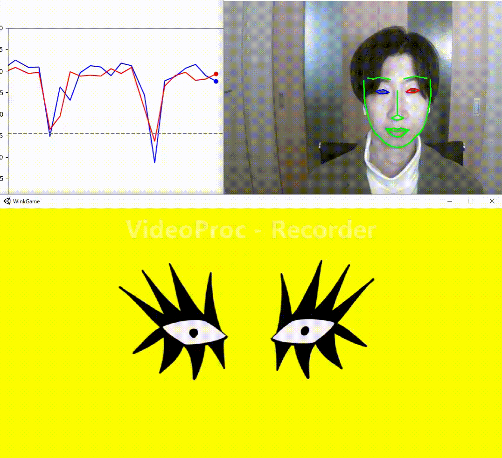
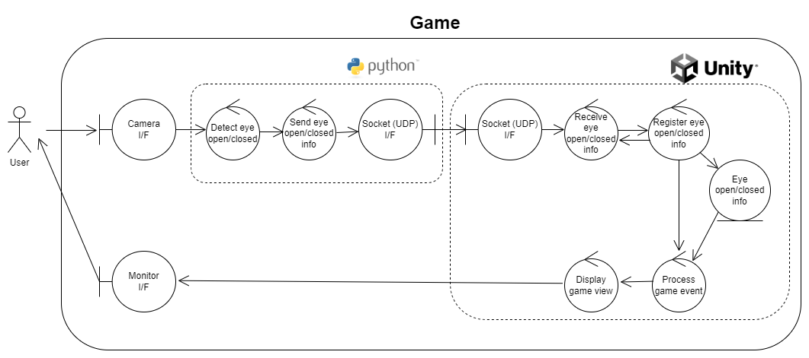

# WinkGameProject

## Overview  
This project is to create a game of using user wink detection information.  
It is Co-developed with [TakanariSimbo][].  

Regarding of an overview of the system structure for the game, please refer to the robustness diagram below.  

## Reauirement and Usage  

**Wink detection function (Python)**  
Please jump to [wink_detection] page and set up the environment.

**Game function (Unity)**  
Please clone/download this repository and run _Application/Release/WinkGame.exe_. 

## About Unity source  
The pre-build Unity environment is placed in _Development/trunk/_.  
Please open the project by Unity ver.2020.3.38f.  

## Future  
Now, under development.  
A function is implemented to reflect the wink information to unity animation events. 
We will be building up the game department in the future.

[TakanariSimbo]: https://github.com/TakanariShimbo "TakanariSimbo"
[wink_detection]: https://github.com/TakanariShimbo/wink_detection "wink_detection"
